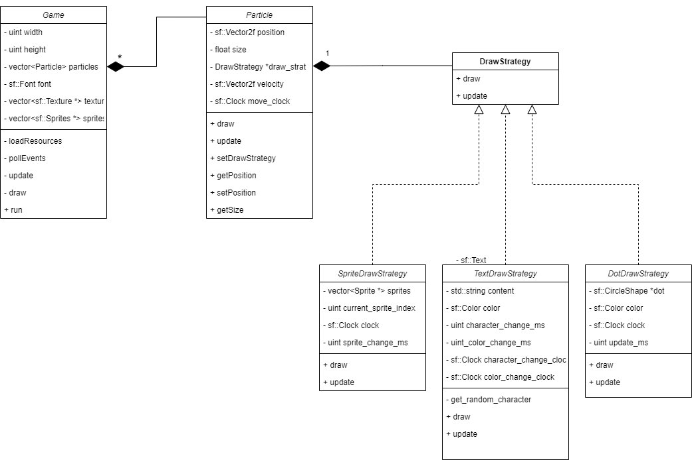

# Strategy Design Pattern Demo

This project is a demo for the Strategy design pattern. It features a particle system that implements this design pattern for its drawing system :



You may compile it yourself by following the instructions below.

Alternatively, you may download the executable ready to go for Linux or Windows from the **Release** section.

## Building for Release

### **On Windows**

You need to have **Git**, **MSBuild**, **CMake** and **vcpkg** installed for the project to compile on your machine.

If you haven't MSBuild installed, head to https://visualstudio.microsoft.com/downloads/, scroll down to "Tools for Visual Studio" and download "Build Tools for Visual Studio 2022". This will give you a GUI to select which components you want. Choose at least "MSVC v143 - VS 2022 C++ x64/x86 Build Tools", and start the download. This should take a while, as these tools are several gigabytes heavy.

If you don't have Git already, install it using https://git-scm.com/download/win. The installer is straightforward.

CMake can be obtained here: https://cmake.org/download/. Get the latest version. Like Git, the installer is straightforward.

Then [**vcpkg**](https://vcpkg.io/en/getting-started.html) can be installed by cloning its repository. I suggest putting it at the root of your hard drive (C:\vcpkg).

```
git clone https://github.com/Microsoft/vcpkg.git
```

Then bootstrap it:

```
.\vcpkg\bootstrap-vcpkg.bat
```

Integrate it with MSBuild:

```
vcpkg integrate install:
```

Install SFML (this will take a while):

```
vcpkg install sfml:x64-windows
```

You are all set to compile the project.

Go at the root of the project, create a "build" subfolder, and open a powershell in it, then type the following command. Note that if you have installed vcpkg in a different folder, you must change the path specified by CMAKE_TOOLCHAIN_FILE accordingly.

```
cmake .. "-DCMAKE_TOOLCHAIN_FILE=C:/vcpkg/scripts/buildsystems/vcpkg.cmake"
```

This will generate a sln file in the build folder. Execute this file :

```
C:\Program Files\Microsoft Visual Studio\2022\Community\MSBuild\Current\Bin\MSBuild.exe .\MySFMLProject.sln
```

This will create a bunch of files. From inside your build folder, copy the contents of the "Debug" subfolder into **a new folder** "SFMLParticleEffects" on your desktop. Then head to the root of the project, and copy the asset folder to that folder. The contents should look like this :

```
├── SFMLParticleSystemVS.exe
├── assets
│   ├── fonts
│   │   └── tuffy.ttf
│   └── images
│       ├── computer_explorer_2k-3.png
│       ├── executable-0.png
│       ├── game_freecell-1.png
│       ├── game_solitaire-0.png
│       ├── help_book_big-0.png
│       ├── ms_dos-1.png
│       ├── msie1-1.png
│       ├── processor-1.png
│       ├── recycle_bin_full-0.png
│       ├── windows-0.png
│       └── wm-2.png
├── brotlicommon.dll
├── brotlidec.dll
├── bz2d.dll
├── freetyped.dll
├── libpng16d.dll
├── sfml-graphics-d-2.dll
├── sfml-system-d-2.dll
├── sfml-window-d-2.dll
└── zlibd1.dll
```

Finally, execute SFMLParticleSystemVS.exe.

### **On Linux**

You need g++, Git, CMake and vcpkg.

To install **g++** refer to the instruction related to your distribution. On Ubuntu:

```
sudo apt install build-essential
```

Then, install **Git**. On Ubuntu:

```
sudo apt install git
```

Then, install **CMake**. On Ubuntu:

```
sudo apt install cmake
```

Finally, install [**vcpkg**](https://vcpkg.io/en/getting-started.html). I suggest cloning it into your downloads folder.

```
git clone https://github.com/Microsoft/vcpkg.git
```

Go into the cloned repositor, and boostrap it:

```
./vcpkg/bootstrap-vcpkg.sh

```

Install sfml

```
./vcpkg install sfml:x64-linux
```

This might take a while.

After that, go at the root of the project, create a "**build**" subfolder and cd into it.

```
mkdir build
cd build
```

From there, launch this command to generate a Makefile (edit the command to match your username):

```
cmake .. "-DCMAKE_TOOLCHAIN_FILE=/home/USERNAME/Downloads/vcpkg/scripts/buildsystems/vcpkg.make"
```

After that the makefile will be generated. Launch it using **make** (installed with build-essential):

```
make
```

This will generate an executable called "MySFMLProject". Copy this executable to a new folder on your desktop, then copy the asset folder located at the root of the project to this new folder. Then launch the MySFMLProject executable and voilà !

## Developping the solution further

I have included in the repository the sln file of the project for developpment purposes. This can be opened with Visual Studio. However, this also requires that you [install SFML on your machine] (https://www.sfml-dev.org/download/sfml/2.6.0/) and that you [reconfigure the project](https://www.sfml-dev.org/tutorials/2.6/start-vc.php) with your own installation of the SFML afterwards
